# Hugo pipeline

This is a CDK project to build a static web site using Hugo and its delivery pipeline.

## Architecture



## How to use

### Deploy CDK

Deploy this CDK project.

 * `npm run build`   compile typescript to js
 * `cdk deploy`      deploy this stack to your default AWS account/region

### Delivery contents

When complete to `cdk deploy`, you can get a **CodeCommit repository URL** from CDK Outputs.  
So...

* `hugo new site hugo-pipeline-source`
* `cd hugo-pipeline-source`
* `git init`
* `git remote add origin <the repository URL>`

### Add a Hugo theme

* `git submodule add https://github.com/theNewDynamic/gohugo-theme-ananke.git themes/ananke`
* `echo theme = \"ananke\" >> config.toml`

See also : [Hugo: Quick Start](https://gohugo.io/getting-started/quick-start/
)
### Add some content

* `hugo new posts/my-first-post.md`
* So edit the file and save.
    ```
    ---
    title: "My First Post"
    date: 2019-03-26T08:47:11+09:00
    draft: false
    ---

    Hello World!!
    ```

### Push the content

* `git add .`
* `git commit -m "Initialize commit"`
* `git push origin main`

Then the pipeline is started. Please wait for the pipeline completion.

### Access the site

When complete `cdk deploy`, you can get a **Site URL of CloudFront** from CDK Outputs.  
Let's access the URL via your browser!!

## CDK context paramter

at `cdk.json`

* `prefix`: prefix for resource logical id and resource name (ex. CodeCommit repository name).
 Default is `hugo-pipeline`
* `hugoVersion`: Hugo version. Currently it's set `0.88.1`.

## TODO

* Enable access logging for CloudFront
* Invalidate CloudFront cache when the contents are delivered